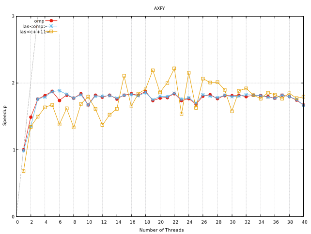
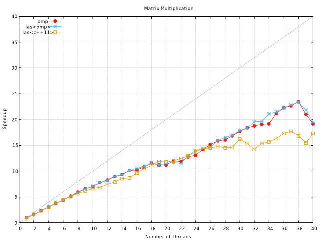
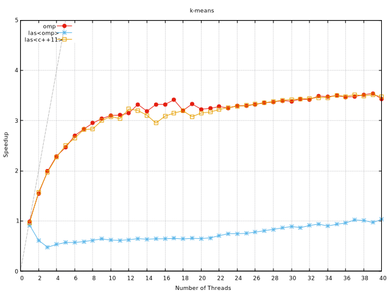

<div id="top"></div>
<!--
*** Thanks for checking out the Best-README-Template. If you have a suggestion
*** that would make this better, please fork the repo and create a pull request
*** or simply open an issue with the tag "enhancement".
*** Don't forget to give the project a star!
*** Thanks again! Now go create something AMAZING! :D
-->


<!-- PROJECT SHIELDS -->
<!--
*** I'm using markdown "reference style" links for readability.
*** Reference links are enclosed in brackets [ ] instead of parentheses ( ).
*** See the bottom of this document for the declaration of the reference variables
*** for contributors-url, forks-url, etc. This is an optional, concise syntax you may use.
*** https://www.markdownguide.org/basic-syntax/#reference-style-links
-->
[![Contributors][contributors-shield]][contributors-url]
[![Forks][forks-shield]][forks-url]
[![Stargazers][stars-shield]][stars-url]
[![Issues][issues-shield]][issues-url]
[![MIT License][license-shield]][license-url]
[![LinkedIn][linkedin-shield]][linkedin-url]


<!-- PROJECT LOGO -->
<br />
<div align="center">
  <a href="https://github.com/vascolleitao/las">
    
  </a>

<h3 align="center">LAS - Layered Algorithmic Skeletons</h3>

  <p align="center">
    LAS is an Algorithmic Skeleton Library with multiple layers of parallelization 
    <br />
    <a href="https://vascolleitao.github.io/las"><strong>Explore the docs »</strong></a>
    <br />
    <br />
    <a href="https://github.com/vascolleitao/las">View Demo</a>
    ·
    <a href="https://github.com/vascolleitao/las/issues">Report Bug</a>
    ·
    <a href="https://github.com/vascolleitao/las/issues">Request Feature</a>
  </p>
</div>


<!-- TABLE OF CONTENTS -->
<details>
  <summary>Table of Contents</summary>
  <ol>
    <li><a href="#about-the-project">About The Project</a></li>
    <li>
      <a href="#getting-started">Getting Started</a>
      <ul>
        <li><a href="#prerequisites">Prerequisites</a></li>
        <li><a href="#installation">Installation</a></li>
      </ul>
    </li>
    <li>
      <a href="#usage">Usage</a>
      <ul>
        <li><a href="#map">Map</a></li>   
        <li><a href="#reduce">Reduce</a></li>    
        <li><a href="#fusion">Fusion</a></li>      
        <li><a href="#filter">Filter</a></li>      
        <li><a href="#adapter-zip">Adapter Zip</a></li>        
        <li><a href="#adapter-index">Adapter Index</a></li>          
        <li><a href="#adapter-dummy">Adapter Dummy</a></li>          
        <li><a href="#omp-layer">OMP layer</a></li>          
      </ul>
    </li>
    <li><a href="#architecture">Architecture</a></li>
    <li><a href="#benchmark">Benchmark</a></li>
    <li><a href="#roadmap">Roadmap</a></li>
    <li><a href="#contributing">Contributing</a></li>
    <li><a href="#license">License</a></li>
    <li><a href="#contact">Contact</a></li>
    <li><a href="#acknowledgments">Acknowledgments</a></li>
  </ol>
</details>


<!-- ABOUT THE PROJECT -->
## About The Project

LAS aspires to be a user-friendly library by encapsulating all parallel functionality within the skeletons, removing the requirement for the user to understand or code anything about parallelization. The user simply needs to understand the skeletons' semantics.

Because the parallelization layers are coupled at compile time using inheritance and templates, LAS is capable of obtaining good performance. The library may also activate and deactivate specific layers at compile time, allowing the skeletons to be implemented on various hardware architectures.

Multiple layers can be activated simultaneously using LAS, allowing hybrid parallelization layers, such as OpenMP and MPI (albeit not yet!). As a result, LAS is a highly adaptable and portable algorithmic library.

LAS began as a master's thesis entitled "Padrões arquitecturais e de desenho para aplicações paralelas" (Architectural and Design Patterns for parallel applications) oriented by Prof. Dr. João Luís Ferreira Sobral. The dissertation's goal was to improve the architecture of HPC/parallel applications. LAS is an algorithmic skeleton library that uses numerous parallelization layers to implement skeletons. This project is still in development.

<p align="right">(<a href="#top">back to top</a>)</p>


<!-- GETTING STARTED -->
## Getting Started

This section shows how you may set up LAS locally by cloning a local copy and running the following steps.

### Prerequisites

The prerequisites to install the library are: 
* C++ compiler with standard C++20
* OpenMP 

### Installation

1. Clone the repo
```sh
  git clone https://github.com/vascolleitao/las.git
```
2. Building
```sh
  cmake -B build -S las
  cmake --build build
```
3. Testing
```sh
  ctest --ctest-dir build
```
4. Installing
```sh
  cmake --install build \
        --prefix <INSTALL-DIR> 
```

<p align="right">(<a href="#top">back to top</a>)</p>

<!-- USAGE EXAMPLES -->
## Usage

As explained above, LAS has a layered architecture that permits its utilization with the three following modes of utilization:
 - Default: only uses the sequential layer;
 - Static: uses compile definitions to use specific layers at compile-time;
 - Dynamic: compiles all the layers and chooses the best one for a specific collection and skeleton(s). 

You can choose one of these modes at compile time by linking the executable with the respective libraries: *las*, *las_static* or *las_dynamic*. If you link it with *las_static*, you also need to link it with the specific layers (e.g., *las_cpu_layer* and *las_omp_layer*).

Next, you can see various examples of the utilization of skeletons.


### Map

Here is a simple example of incrementing all elements of a collection:

```cpp
std::vector<int> vec(1000);
vec >>= las::map(inc());
```

### Reduce

This example shows how you can sum up all the elements of one collection.

```cpp
std::vector<int> vec{ 1, 1, 1, 1, 1, 1, 1, 1, 1, 1 };
auto [sum] = vec >>= las::reduce(std::plus<int>());
```

### Fusion

This example shows how you can fuse two reduces. This operation returns a tuple. The first element results from the first reduction, and the second element from the second reduction.

```cpp
std::vector<int> vec{ 1, 2, 3, 4, 5, 6, 7, 8, 9 };
auto [min, max] = vec
  >>= las::reduce(las::min<int>())
  >>= las::reduce(las::max<int>());
```

Note that the first reduce is applied to the original collection, and the second reduce is applied after mapping "complex_computation" to all collection elements. But both reduces are computed in the same loop.

```cpp
std::vector<int> vec(100);
auto [sum_before_map, sum_after_map] = vec
  >>= las::reduce(std::plus<int>())
  >>= las::map(complex_computation())
  >>= las::reduce(std::plus<int>());
```

### Filter

This example shows the usage of the filter skeleton to erase a collection's even numbers by applying the skeleton map with the functor clear to the filtered ones. 

```cpp
std::vector<int> vec{ 1, 2, 3, 4, 5, 6, 7, 8, 9, 10 };
vec >>= las::filter(even())
    >>= las::map(clear());
```
### Adapter Zip

This example shows how you can apply the zip adapter to allow the iteration of multiple collections simultaneously.
This example computes the multiplication pointwise of two vectors *vx* and *vy* and stores the resulting vector on *vz*.

```cpp
las::zip(vx, vy, vr) 
  >>= las::map(
    [](const auto& x, const auto& y, auto& r){ r = x*y;});
```

### Adapter Index

This example shows how to initialize the elements of a vector of the same position index.

```cpp
las::index(vec) >>= las::map([](int i, auto& v){ v[i] = i };);
```

### Adapter Dummy

Example of sharing variables between skeletons. Note that the dummy variable is not a collection, but LAS treats it as one. Note that using shared memory parallelization in this example results in having one copy of this variable in every thread.

```cpp
pow = [](const int& x, int& d){ d = x*x };
las::zip(std::span(1,100), las::dummy<int>())
  >>= las::map(pow)
  >>= las::reduce(sum()) ;
```

### OMP layer

Using the map skeleton with threads. Here is a simple example of initializing each element with the corresponding thread's number.
The direct use of omp functions **is not recommended** since this code will only compile with the OMP layer, making it less portable.

```cpp
std::vector<int> vec(1000);
auto thread_num = [](auto& i) { i = omp_get_thread_num(); };
vec >>= las::map(thread_num);
```

<p align="right">(<a href="#top">back to top</a>)</p>

<!-- Architecture -->
## Architecture

_For more examples, please refer to the [Documentation](https://vascolleitao.github.io/las)_
<p align="right">(<a href="#top">back to top</a>)</p>

<!-- Benchmark -->
## Benchmark

The benchmark of the application used three different applications: axpy, k-means and matrix multiplication.
The three problems have different complexities: the first one is linear, the second is quadratic, and the last one is an iterative heuristic solution to the k-means problem, where the skeletons are used multiple times by iteration. In the following plots, you can compare two examples of LAS shared memory (c++11 and omp threads) with a pure omp example.

The axpy problem is simply multiplying a vector by a scalar and summing the result with another vector pointwise.
The three versions have similar speedups. Although for smaller inputs, the c++11 layer has better performance than OMP (not seen in these plots).

As expected, the matrix multiplication has good speedups due to being more computation-intensive by element, and the difference between using pure omp or the more simple skeletons approach is negligible. 

In the k-means problem, as seen in the plot, the speedup of las with the omp layer has a problem, which can be partially explained by the fusion of multiple reduces, which makes LAS use multiple barriers to synchronize the threads instead of just one. With the LAS using the c++11 threads layer, this problem didn't occur because the fusion was explicitly programmed.

<p style="background-color:white">
  
  
   
</p>

Note that using the LAS library with only the sequential layer had the same performance as implementation without skeletons.

_For more examples, please refer to the [Documentation](https://vascolleitao.github.io/las)_
<p align="right">(<a href="#top">back to top</a>)</p>

<!-- ROADMAP -->
## Roadmap

- Skeletons
    - [X] Map
    - [X] Reduce
    - [X] Fusion
    - [X] Filter
- Adapters
    - [X] Simple
    - [X] Index
    - [X] Zip
    - [ ] Reverse
- Parallelization
    - [X] Shared memory layer
        - [X] OMP 
        - [X] C++11 threads 
        - [ ] TBB 
    - [ ] Distributed memory layer
        - [ ] MPI 
    - [ ] GPU layer
        - [ ] CUDA 
        - [ ] OpenCL 

See the [open issues](https://github.com/vascolleitao/las/issues) for a full list of proposed features (and known issues).

<p align="right">(<a href="#top">back to top</a>)</p>


<!-- CONTRIBUTING -->
## Contributing

Contributions are what make the open source community such a fantastic place to learn, inspire, and create. Any contributions you make are **greatly appreciated**.

If you have a suggestion that would make this better, please fork the repo and create a pull request. You can also simply open an issue with the tag "enhancement".
Don't forget to give the project a star! Thanks again!

1. Fork the Project
2. Create your Feature Branch (`git checkout -b feature/AmazingFeature`)
3. Commit your Changes (`git commit -m 'Add some AmazingFeature'`)
4. Push to the Branch (`git push origin feature/AmazingFeature`)
5. Open a Pull Request

<p align="right">(<a href="#top">back to top</a>)</p>


<!-- LICENSE -->
## License

Distributed under the GPLv3 License.

<p align="right">(<a href="#top">back to top</a>)</p>


<!-- CONTACT -->
## Contact

Vasco Leitão - [Vascolleitao](https://twitter.com/vascolleitao) - vascolleitao@gmail.com

Project Link: [https://github.com/vascolleitao/las](https://github.com/vascolleitao/las)

<p align="right">(<a href="#top">back to top</a>)</p>

<!-- MARKDOWN LINKS & IMAGES -->
<!-- https://www.markdownguide.org/basic-syntax/#reference-style-links -->
<!-- [contributors-shield]: https://img.shields.io/github/contributors/vascolleitao/las.svg?style=for-the-badge -->
[contributors-shield]: https://img.shields.io/github/contributors/vascolleitao/las.svg?style=for-the-badge
[contributors-url]: https://github.com/vascolleitao/las/graphs/contributors
[forks-shield]: https://img.shields.io/github/forks/vascolleitao/las.svg?style=for-the-badge
[forks-url]: https://github.com/vascolleitao/las/network/members
[stars-shield]: https://img.shields.io/github/stars/vascolleitao/las.svg?style=for-the-badge
[stars-url]: https://github.com/vascolleitao/las/stargazers
[issues-shield]: https://img.shields.io/github/issues/vascolleitao/las.svg?style=for-the-badge
[issues-url]: https://github.com/vascolleitao/las/issues
[license-shield]: https://img.shields.io/github/license/vascolleitao/las.svg?style=for-the-badge
[license-url]: https://github.com/vascolleitao/las/blob/master/LICENSE
[linkedin-shield]: https://img.shields.io/badge/-LinkedIn-black.svg?style=for-the-badge&logo=linkedin&colorB=555
[linkedin-url]: https://linkedin.com/in/vascolleitao
