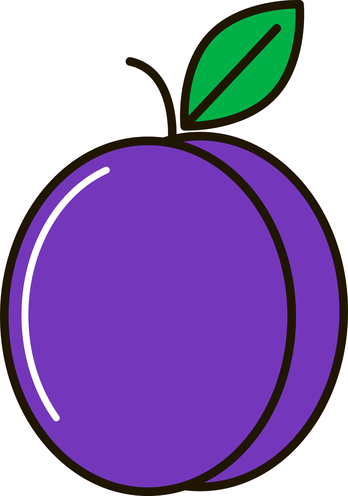

<div id="top"></div>
<!--
*** Thanks for checking out the Best-README-Template. If you have a suggestion
*** that would make this better, please fork the repo and create a pull request
*** or simply open an issue with the tag "enhancement".
*** Don't forget to give the project a star!
*** Thanks again! Now go create something AMAZING! :D
-->


<!-- PROJECT SHIELDS -->
<!--
*** I'm using markdown "reference style" links for readability.
*** Reference links are enclosed in brackets [ ] instead of parentheses ( ).
*** See the bottom of this document for the declaration of the reference variables
*** for contributors-url, forks-url, etc. This is an optional, concise syntax you may use.
*** https://www.markdownguide.org/basic-syntax/#reference-style-links
-->
[![Contributors][contributors-shield]][contributors-url]
[![Forks][forks-shield]][forks-url]
[![Stargazers][stars-shield]][stars-url]
[![Issues][issues-shield]][issues-url]
[![MIT License][license-shield]][license-url]
[![LinkedIn][linkedin-shield]][linkedin-url]


<!-- PROJECT LOGO -->
<br />
<div align="center">
  <a href="https://github.com/vascolleitao/skl/tree/develop">
    
  </a>

<h3 align="center">SKL</h3>

  <p align="center">
    SKL is an Algoritmic Skeleton Framework with multiple layers of parallelization 
    <br />
    <a href="https://github.com/vascolleitao/skl"><strong>Explore the docs »</strong></a>
    <br />
    <br />
    <a href="https://github.com/vascolleitao/skl">View Demo</a>
    ·
    <a href="https://github.com/vascolleitao/skl/issues">Report Bug</a>
    ·
    <a href="https://github.com/vascolleitao/skl/issues">Request Feature</a>
  </p>
</div>


<!-- TABLE OF CONTENTS -->
<details>
  <summary>Table of Contents</summary>
  <ol>
    <li>
      <a href="#about-the-project">About The Project</a>
      <ul>
        <li><a href="#built-with">Built With</a></li>
      </ul>
    </li>
    <li>
      <a href="#getting-started">Getting Started</a>
      <ul>
        <li><a href="#prerequisites">Prerequisites</a></li>
        <li><a href="#installation">Installation</a></li>
      </ul>
    </li>
    <li><a href="#usage">Usage</a></li>
    <li><a href="#roadmap">Roadmap</a></li>
    <li><a href="#contributing">Contributing</a></li>
    <li><a href="#license">License</a></li>
    <li><a href="#contact">Contact</a></li>
    <li><a href="#acknowledgments">Acknowledgments</a></li>
  </ol>
</details>


<!-- ABOUT THE PROJECT -->
## About The Project

SKL aims to be an easy to use library. SKL achieves this by encapsulating all of the parallel code inside the skeletons, so that the user wont need to know/code anything related to parallelization. The user only needs to know the semantics of the skletons.

SKL is capable of achieving good performing, because the coupling of the parallelization layers is made at compile time with the use of inheritance and templates. 

SKL has the ability to activate and deactivate specific layers at compile adapting the implementation of the skeletons to diferent kinds of hardware arquitectures. SKL can activate multiple layers at the same time wich makes hybrid layers of parallelizaion possibly like OpenMP and MPI (not yet!). This makes SKL a very flexible and portable algoritmic library.  


SKL started as a master dissertation project with the aim of giving HPC/parallel solutions a better architecture. SKL is, as refered, an algoritmic skeleton library implementing the skeletons with multiple layers of parallelization. This is a fork of the original private project. SKL is still being develop. 

<p align="right">(<a href="#top">back to top</a>)</p>


<!-- GETTING STARTED -->
## Getting Started

This is an example of how you may set up SKL project locally.
By cloning a local copy up and running follow these simple example steps.

### Prerequisites

The prerequisite to install library the full libarary are: 
* C++ compiler with standard C++20

Depending on the paralelization layer you may also need:
* OpenMP 

### Installation

1. Clone the repo
    ```sh
    git clone https://github.com/vascolleitao/skl.git
    ```
2. Building
    ```sh
    cmake -B build -S skl
    cmake --build build
    ```
3. Testing
    ```sh
    ctest --ctest-dir build
    ```
4. Installing
    ```sh
    cmake --install build \
          --prefix <INSTALL-DIR> \
          --component skl
    ```


<p align="right">(<a href="#top">back to top</a>)</p>


<!-- USAGE EXAMPLES -->
## Usage

# An example of using the map skeleton

Here is a simple example of incrementing all the elements of a collection:

```cpp
std::vector<int> vec(1000);
vec >>= skl::map(inc());
```

# An example of using the reduce skeleton

This example show how to summ all the elemnts of one collection.

```cpp
std::vector<int> vec{ 1, 1, 1, 1, 1, 1, 1, 1, 1, 1 };
auto [sum] = vec >>= skl::reduce(std::plus<int>());
```

# Example: Fusion multiple skeletons together

This example shows the fusion of two reduces. This operation returns a tuple, the first element corresponds to the result of the first reduce and the second element two the second reduce fused.

```cpp
std::vector<int> vec{ 1, 2, 3, 4, 5, 6, 7, 8, 9 };
auto [min, max] = vec
  >>= skl::reduce(skl::min<int>())
  >>= skl::reduce(skl::max<int>());
```

Note that in this example the first reduce is applyed to the original collection and the second reduce is applyed after computing the "complex_computation" on all elements of the collection. But both reduces are computed with only one loop, like lazy evaluation.

```cpp
const size_t size(1000);
std::vector<int> vec(size);
const int expected_sum_before_map = 0;
const int expected_sum_after_map = size;

auto [sum_before_map, sum_after_map] = vec
  >>= skl::reduce(std::plus<int>())
  >>= skl::map(complex_computation())
  >>= skl::reduce(std::plus<int>());
```

# Example: Skeleton filter

In this example a filter is used to erase the even numbers of a collection by applyn the skeleton map with the functor clear to the filtered ones. 
```cpp
std::vector<int> vec{ 1, 2, 3, 4, 5, 6, 7, 8, 9, 10 };
vec
  >>= skl::filter(even())
  >>= skl::map(clear());
```

_For more examples, please refer to the [Documentation](https://example.com)_

<p align="right">(<a href="#top">back to top</a>)</p>


<!-- ROADMAP -->
## Roadmap

- Skeletons
    - [X] Map
    - [X] Reduce
    - [X] Fusion
    - [ ] Filter
- Adapters
    - [X] Simple
    - [X] Index
    - [X] Zip
    - [ ] Reverse
- Parallelization
    - [X] Shared memory layer
        - [X] OMP 
        - [X] C++11 threads 
        - [ ] TBB 
    - [ ] Distributed memory layer
        - [ ] MPI 
    - [ ] GPU layer
        - [ ] CUDA 
        - [ ] OpenCL 

See the [open issues](https://github.com/vascolleitao/skl/issues) for a full list of proposed features (and known issues).

<p align="right">(<a href="#top">back to top</a>)</p>


<!-- CONTRIBUTING -->
## Contributing

Contributions are what make the open source community such an amazing place to learn, inspire, and create. Any contributions you make are **greatly appreciated**.

If you have a suggestion that would make this better, please fork the repo and create a pull request. You can also simply open an issue with the tag "enhancement".
Don't forget to give the project a star! Thanks again!

1. Fork the Project
2. Create your Feature Branch (`git checkout -b feature/AmazingFeature`)
3. Commit your Changes (`git commit -m 'Add some AmazingFeature'`)
4. Push to the Branch (`git push origin feature/AmazingFeature`)
5. Open a Pull Request

<p align="right">(<a href="#top">back to top</a>)</p>


<!-- LICENSE -->
## License

Distributed under the GPLv3 License.

<p align="right">(<a href="#top">back to top</a>)</p>


<!-- CONTACT -->
## Contact

Vasco Leitão - [@vascolleitao](https://twitter.com/vascolleitao) - vascolleitao@gmail.com

Project Link: [https://github.com/vascolleitao/skl](https://github.com/vascolleitao/skl)

<p align="right">(<a href="#top">back to top</a>)</p>


<!-- MARKDOWN LINKS & IMAGES -->
<!-- https://www.markdownguide.org/basic-syntax/#reference-style-links -->
[contributors-shield]: https://img.shields.io/github/contributors/vascolleitao/skl.svg?style=for-the-badge
[contributors-url]: https://github.com/vascolleitao/skl/graphs/contributors
[forks-shield]: https://img.shields.io/github/forks/vascolleitao/skl.svg?style=for-the-badge
[forks-url]: https://github.com/vascolleitao/skl/network/members
[stars-shield]: https://img.shields.io/github/stars/vascolleitao/skl.svg?style=for-the-badge
[stars-url]: https://github.com/vascolleitao/skl/stargazers
[issues-shield]: https://img.shields.io/github/issues/vascolleitao/skl.svg?style=for-the-badge
[issues-url]: https://github.com/vascolleitao/skl/issues
[license-shield]: https://img.shields.io/github/license/vascolleitao/skl.svg?style=for-the-badge
[license-url]: https://github.com/vascolleitao/skl/blob/master/LICENSE.txt
[linkedin-shield]: https://img.shields.io/badge/-LinkedIn-black.svg?style=for-the-badge&logo=linkedin&colorB=555
[linkedin-url]: https://linkedin.com/in/vascolleitao


