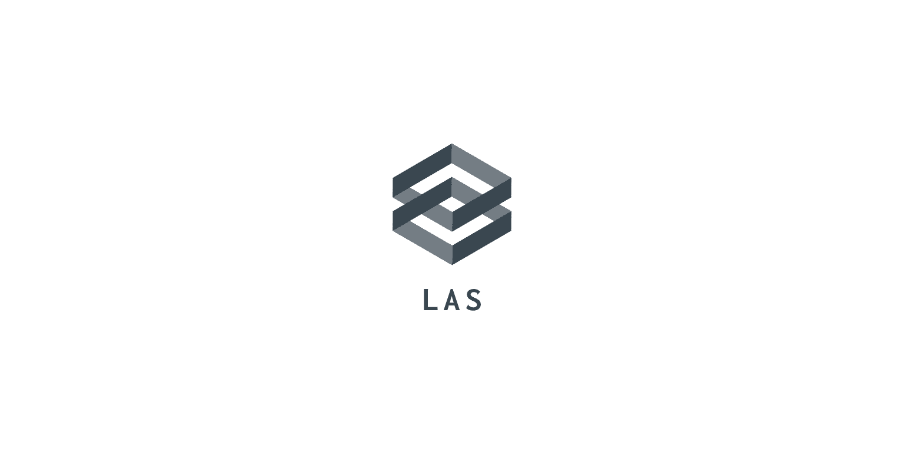

<div id="top"></div>
<!--
*** Thanks for checking out the Best-README-Template. If you have a suggestion
*** that would make this better, please fork the repo and create a pull request
*** or simply open an issue with the tag "enhancement".
*** Don't forget to give the project a star!
*** Thanks again! Now go create something AMAZING! :D
-->


<!-- PROJECT SHIELDS -->
<!--
*** I'm using markdown "reference style" links for readability.
*** Reference links are enclosed in brackets [ ] instead of parentheses ( ).
*** See the bottom of this document for the declaration of the reference variables
*** for contributors-url, forks-url, etc. This is an optional, concise syntax you may use.
*** https://www.markdownguide.org/basic-syntax/#reference-style-links
-->
[![Contributors][contributors-shield]][contributors-url]
[![Forks][forks-shield]][forks-url]
[![Stargazers][stars-shield]][stars-url]
[![Issues][issues-shield]][issues-url]
[![MIT License][license-shield]][license-url]
[![LinkedIn][linkedin-shield]][linkedin-url]


<!-- PROJECT LOGO -->
<br />
<div align="center">
  <a href="https://github.com/vascolleitao/las">
    
  </a>

<h3 align="center">LAS - Layered Algorithmic Skeletons</h3>

  <p align="center">
    LAS is an Algorithmic Skeleton Library with multiple layers of parallelization 
    <br />
    <a href="https://vascolleitao.github.io/las"><strong>Explore the docs »</strong></a>
    <br />
    <br />
    <a href="https://github.com/vascolleitao/las">View Demo</a>
    ·
    <a href="https://github.com/vascolleitao/las/issues">Report Bug</a>
    ·
    <a href="https://github.com/vascolleitao/las/issues">Request Feature</a>
  </p>
</div>


<!-- TABLE OF CONTENTS -->
<details>
  <summary>Table of Contents</summary>
  <ol>
    <li>
      <a href="#about-the-project">About The Project</a>
      <ul>
        <li><a href="#built-with">Built With</a></li>
      </ul>
    </li>
    <li>
      <a href="#getting-started">Getting Started</a>
      <ul>
        <li><a href="#prerequisites">Prerequisites</a></li>
        <li><a href="#installation">Installation</a></li>
      </ul>
    </li>
    <li><a href="#usage">Usage</a></li>
    <li><a href="#roadmap">Roadmap</a></li>
    <li><a href="#contributing">Contributing</a></li>
    <li><a href="#license">License</a></li>
    <li><a href="#contact">Contact</a></li>
    <li><a href="#acknowledgments">Acknowledgments</a></li>
  </ol>
</details>


<!-- ABOUT THE PROJECT -->
## About The Project

LAS aspires to be a user-friendly library. This is accomplished by encapsulating all parallel functionality within the skeletons, removing the requirement for the user to understand or code anything about parallelization. The user simply needs to understand the skeletons' semantics.

Because the parallelization layers are coupled at compile time using inheritance and templates, LAS is capable of obtaining good performance. The library may also activate and deactivate certain layers at compile time, allowing the skeletons to be implemented on a variety of hardware architectures.

Multiple layers can be activated at the same time using LAS. This allows for hybrid levels of parallelization, such as OpenMP and MPI (albeit not yet!). As a result, LAS is a highly adaptable and portable algorithmic library.

LAS began as a master's thesis entitled "Architectural and design patterns for parallel applications," oriented by Prof. Dr. João Luís Ferreira Sobral. The dissertation's goal was to improve the architecture of HPC/parallel applications. LAS is an algorithmic skeleton library that uses numerous layers of parallelization to implement skeletons. This is a continuation of the original private project, which is currently in development.

<p align="right">(<a href="#top">back to top</a>)</p>


<!-- GETTING STARTED -->
## Getting Started

This is an example of how you may set up LAS locally.
By cloning a local copy and running the following simple example steps.

### Prerequisites

The prerequisite to install the library are: 
* C++ compiler with standard C++20

Depending on the parallelization layer, you may also need:
* OpenMP 

### Installation

1. Clone the repo
    ```sh
    git clone https://github.com/vascolleitao/las.git
    ```
2. Building
    ```sh
    cmake -B build -S las
    cmake --build build
    ```
3. Testing
    ```sh
    ctest --ctest-dir build
    ```
4. Installing
    ```sh
    cmake --install build \
          --prefix <INSTALL-DIR> 
    ```

<p align="right">(<a href="#top">back to top</a>)</p>


<!-- USAGE EXAMPLES -->
## Usage

### An example of using the map skeleton

Here is a simple example of incrementing all elements of a collection:

```cpp
std::vector<int> vec(1000);
vec >>= las::map(inc());
```

### An example of using the reduce skeleton

This example shows how to sum all the elements of one collection.

```cpp
std::vector<int> vec{ 1, 1, 1, 1, 1, 1, 1, 1, 1, 1 };
auto [sum] = vec >>= las::reduce(std::plus<int>());
```

### Example: Fusion multiple skeletons together

This example shows the fusion of two reduces. This operation returns a tuple, the first element corresponds to the result of the first reduce and the second element two the second reduce fused.

```cpp
std::vector<int> vec{ 1, 2, 3, 4, 5, 6, 7, 8, 9 };
auto [min, max] = vec
  >>= las::reduce(las::min<int>())
  >>= las::reduce(las::max<int>());
```

Note that in this example, the first reduce is applied to the original collection and the second reduce is applied after computing the "complex_computation" on all elements of the collection. But both reduces are computed with only one loop, like lazy evaluation.

```cpp
std::vector<int> vec(100);
auto [sum_before_map, sum_after_map] = vec
  >>= las::reduce(std::plus<int>())
  >>= las::map(complex_computation())
  >>= las::reduce(std::plus<int>());
```

### Example: Skeleton filter

In this example, a filter is used to erase the even numbers of a collection, by applying the skeleton map with the functor clear to the filtered ones. 

```cpp
std::vector<int> vec{ 1, 2, 3, 4, 5, 6, 7, 8, 9, 10 };
vec
  >>= las::filter(even())
  >>= las::map(clear());
```

_For more examples, please refer to the [Documentation](https://vascolleitao.github.io/las)_

<p align="right">(<a href="#top">back to top</a>)</p>


<!-- ROADMAP -->
## Roadmap

- Skeletons
    - [X] Map
    - [X] Reduce
    - [X] Fusion
    - [X] Filter
- Adapters
    - [X] Simple
    - [X] Index
    - [X] Zip
    - [ ] Reverse
- Parallelization
    - [X] Shared memory layer
        - [X] OMP 
        - [X] C++11 threads 
        - [ ] TBB 
    - [ ] Distributed memory layer
        - [ ] MPI 
    - [ ] GPU layer
        - [ ] CUDA 
        - [ ] OpenCL 

See the [open issues](https://github.com/vascolleitao/las/issues) for a full list of proposed features (and known issues).

<p align="right">(<a href="#top">back to top</a>)</p>


<!-- CONTRIBUTING -->
## Contributing

Contributions are what make the open source community such an amazing place to learn, inspire, and create. Any contributions you make are **greatly appreciated**.

If you have a suggestion that would make this better, please fork the repo and create a pull request. You can also simply open an issue with the tag "enhancement".
Don't forget to give the project a star! Thanks again!

1. Fork the Project
2. Create your Feature Branch (`git checkout -b feature/AmazingFeature`)
3. Commit your Changes (`git commit -m 'Add some AmazingFeature'`)
4. Push to the Branch (`git push origin feature/AmazingFeature`)
5. Open a Pull Request

<p align="right">(<a href="#top">back to top</a>)</p>


<!-- LICENSE -->
## License

Distributed under the GPLv3 License.

<p align="right">(<a href="#top">back to top</a>)</p>


<!-- CONTACT -->
## Contact

Vasco Leitão - [@vascolleitao](https://twitter.com/vascolleitao) - vascolleitao@gmail.com

Project Link: [https://github.com/vascolleitao/las](https://github.com/vascolleitao/las)

<p align="right">(<a href="#top">back to top</a>)</p>

<!-- MARKDOWN LINKS & IMAGES -->
<!-- https://www.markdownguide.org/basic-syntax/#reference-style-links -->
<!-- [contributors-shield]: https://img.shields.io/github/contributors/vascolleitao/las.svg?style=for-the-badge -->
[contributors-shield]: https://img.shields.io/github/contributors/vascolleitao/las.svg?style=for-the-badge
[contributors-url]: https://github.com/vascolleitao/las/graphs/contributors
[forks-shield]: https://img.shields.io/github/forks/vascolleitao/las.svg?style=for-the-badge
[forks-url]: https://github.com/vascolleitao/las/network/members
[stars-shield]: https://img.shields.io/github/stars/vascolleitao/las.svg?style=for-the-badge
[stars-url]: https://github.com/vascolleitao/las/stargazers
[issues-shield]: https://img.shields.io/github/issues/vascolleitao/las.svg?style=for-the-badge
[issues-url]: https://github.com/vascolleitao/las/issues
[license-shield]: https://img.shields.io/github/license/vascolleitao/las.svg?style=for-the-badge
[license-url]: https://github.com/vascolleitao/las/blob/master/LICENSE
[linkedin-shield]: https://img.shields.io/badge/-LinkedIn-black.svg?style=for-the-badge&logo=linkedin&colorB=555
[linkedin-url]: https://linkedin.com/in/vascolleitao
