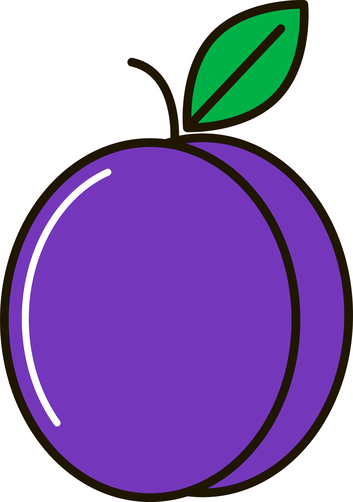

<div id="top"></div>
<!--
*** Thanks for checking out the Best-README-Template. If you have a suggestion
*** that would make this better, please fork the repo and create a pull request
*** or simply open an issue with the tag "enhancement".
*** Don't forget to give the project a star!
*** Thanks again! Now go create something AMAZING! :D
-->


<!-- PROJECT SHIELDS -->
<!--
*** I'm using markdown "reference style" links for readability.
*** Reference links are enclosed in brackets [ ] instead of parentheses ( ).
*** See the bottom of this document for the declaration of the reference variables
*** for contributors-url, forks-url, etc. This is an optional, concise syntax you may use.
*** https://www.markdownguide.org/basic-syntax/#reference-style-links
-->
[![Contributors][contributors-shield]][contributors-url]
[![Forks][forks-shield]][forks-url]
[![Stargazers][stars-shield]][stars-url]
[![Issues][issues-shield]][issues-url]
[![MIT License][license-shield]][license-url]
[![LinkedIn][linkedin-shield]][linkedin-url]


<!-- PROJECT LOGO -->


<br />
<div align="center">
  <a href="https://github.com/vascolleitao/skl">
    
  </a>

<h3 align="center">SKL</h3>

  <p align="center">
    SKL is an Algorithmic Skeleton Framework with multiple layers of parallelization 
    <br />
    <a href="https://github.com/vascolleitao/skl"><strong>Explore the docs »</strong></a>
    <br />
    <br />
    <a href="https://github.com/vascolleitao/skl">View Demo</a>
    ·
    <a href="https://github.com/vascolleitao/skl/issues">Report Bug</a>
    ·
    <a href="https://github.com/vascolleitao/skl/issues">Request Feature</a>
  </p>
</div>


<!-- TABLE OF CONTENTS -->
  <summary>Table of Contents</summary>
  <ol>
    <li> <a href="#getting-started">Getting Started</a> </li>
    <li><a href="#documentation">Documentation</a></li>
    <li><a href="#examples">Examples</a></li>
    <li><a href="#contact">Contact</a></li>
  </ol>


<!-- Getting Started -->
## Getting Started
<p align="right">(<a href="#top">back to top</a>)</p>

<!-- Documentation -->
## Documentation

See the master's thesis document
 <a href="vascolleitao.github.io/pdfs/skl_master_thesis.pdf" target="_blank">here</a>.


<p align="right">(<a href="#top">back to top</a>)</p>

<!-- Examples -->
## Examples

### Using the map skeleton with threads

Here is a simple example initializing each element with the number of the corresponding thread.

```cpp
std::vector<int> vec(1000);
auto thread_num = [](auto& i) { i = omp_get_thread_num(); };
vec >>= skl::map(thread_num);
```

<p align="right">(<a href="#top">back to top</a>)</p>

<!-- CONTACT -->
## Contact

Vasco Leitão - [@vascolleitao](https://twitter.com/vascolleitao) - vascolleitao@gmail.com

Project Link: [https://github.com/vascolleitao/skl](https://github.com/vascolleitao/skl)

<p align="right">(<a href="#top">back to top</a>)</p>


<!-- MARKDOWN LINKS & IMAGES -->
<!-- https://www.markdownguide.org/basic-syntax/#reference-style-links -->
[contributors-shield]: https://img.shields.io/github/contributors/vascolleitao/skl.svg?style=for-the-badge
[contributors-url]: https://github.com/vascolleitao/skl/graphs/contributors
[forks-shield]: https://img.shields.io/github/forks/vascolleitao/skl.svg?style=for-the-badge
[forks-url]: https://github.com/vascolleitao/skl/network/members
[stars-shield]: https://img.shields.io/github/stars/vascolleitao/skl.svg?style=for-the-badge
[stars-url]: https://github.com/vascolleitao/skl/stargazers
[issues-shield]: https://img.shields.io/github/issues/vascolleitao/skl.svg?style=for-the-badge
[issues-url]: https://github.com/vascolleitao/skl/issues
[license-shield]: https://img.shields.io/github/license/vascolleitao/skl.svg?style=for-the-badge
[license-url]: https://github.com/vascolleitao/skl/blob/master/LICENSE.txt
[linkedin-shield]: https://img.shields.io/badge/-LinkedIn-black.svg?style=for-the-badge&logo=linkedin&colorB=555
[linkedin-url]: https://linkedin.com/in/vascolleitao


